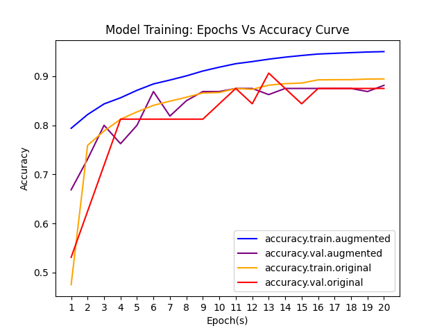
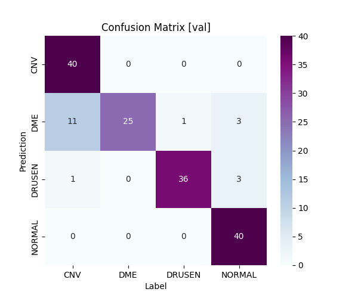

######
README
######

project.classifier.oct
**********************
OCT image classifier to classifiy OCT images into 4 labels - CNV, DME, DRUSEN
and NORMAL.

Requirements
============
Install requirements as::
   
   # requirements:
   pip install opencv-python
   pip install pillow
   pip install keras
   pip install tensorflow
   pip install numpy
   pip install matplotlib
   pip install seaborn

   # or:
   pip install -r requirements.txt

Hyperparameter tuning
=====================
Tune hyperparameters at following locations in file::
   
   # potential locations in file (classifier.oct.py)
   # which you need to change / keep a track of
   
   line  10: environment variables to disable / hide warnings & logs
   line  78: class_mapping
   line  79: augument_params_list
   line  87: Z (definition)
   line  88: K (definition)
   line 279: Z (computation)
   line 280: K (computation)
   line 319: model layers # model.add(...)
   line 339: model metrics
   line 362: model save checkpoints
   line 418: train_batch_size
   line 426: val_batch_size
   line 438: epochs
   line 449: Learning rate scheduler on plateau
   line 456: Constant learning rate scheduler
   line 466: test_batch_size
   line 474: model evaluation (on test dataset)
   line 537: confusion matrix plots file path
   line 564: prediction checkpoint models
   line 574: prediction checkpoint-less model
   line 675: confusion - prediction file - row format

Cleanup
=======
Files to remove to clean up::
   
   # Files to remove to freshly build / train.
   rm confusion.prediction.json
   rm prediction.json
   rm dataset.image.json
   rm model.*.h5

File system (dataset)
=====================
File system required for the program to run::
   
   # Expected file structure
   
   # training dataset (downloaded from kaggle)
   OCT2017/
      train/
         CNV/
            *.jpeg # or .png or .jpg
         DME/
            *.jpeg # or .png or .jpg
         DRUSEN/
            *.jpeg # or .png or .jpg
         NORMAL/
            *.jpeg # or .png or .jpg
      test/
         CNV/
            *.jpeg # or .png or .jpg
         DME/
            *.jpeg # or .png or .jpg
         DRUSEN/
            *.jpeg # or .png or .jpg
         NORMAL/
            *.jpeg # or .png or .jpg
      val/
         CNV/
            *.jpeg # or .png or .jpg
         DME/
            *.jpeg # or .png or .jpg
         DRUSEN/
            *.jpeg # or .png or .jpg
         NORMAL/
            *.jpeg # or .png or .jpg
   
   
   # prediction dataset (create one yourself
   #     by copy-pasting some image from training dataset)
   predict/
      *.jpeg # or .png or .jpg

Actual Dataset
--------------
Dataset sourced from kaggle: `Retinal OCT Images (optical coherence tomography) - https://www.kaggle.com/datasets/paultimothymooney/kermany2018/ <https://www.kaggle.com/datasets/paultimothymooney/kermany2018/>`_.

Running
=======
Running the code::
   
   # How to run:
   # train, predict and build confusion matrix (predict on whole dataset)
   python classifier.oct.py
   
   # train only
   python classifier.oct.py t
   
   # predict only
   python classifier.oct.py p
   
   # train and predict only
   python classifier.oct.py t p
   
   # build confusion matrix (predict on whole dataset) only
   python classifier.oct.py c

Predictions
===========
Prediction storage format::
   
   # prediction.json
   [ # list
      { # row : for checkpoints=True
         "image" : "<file_name>",  # image file name (used)
         
         # class predicted by best 'loss' version of model
         "loss" : "<PREDICTION>",
         
         # class predicted by best 'accuracy' version of model
         "accuracy" : "<PREDICTION>",
         
         # class predicted by best 'accuracy.categorical' version of model
         "accuracy.categorical" : "<PREDICTION>",
         
         # class predicted by best 'mae' version of model
         "mae" : "<PREDICTION>",
         
         # class predicted by best 'mse' version of model
         "mse" : "<PREDICTION>", # class predicted by best 'final' model
         
         # class predicted by best 'final' version of model
         "final" : "<PREDICTION>", # class predicted by best 'final' model
         
         # class predicted by most recent 'iteration' version of model
         "iteration" : "<PREDICTION>",
      },
      { # row : for checkpoints=False
         "image"     : "<file_name>",  # image file name (used)
         "prediction": "<PREDICTION>", # class predicted by model
      },
   ]

Confusion prediction storage format::
   
   # confusion.prediction.json
   [ # list
      { # row
         "path_image" : "<image_file_path>",    # (used) image file path
         "type_image" : "<REAL_or_AUGMENTED>",  # image augmented or not
         "parameters" : <AUGMENTATION_PARAMS>", # augment_params
         "prediction" : "<PREDICTION>",         # class predicted by model
         "label"      : "<LABEL>",              # actual class of image
      },
   ]

Results
=======
Result in figures::
   
   Train accuracy: 95.44 %
   Val   accuracy: 88.13 %
   Test  accuracy: 88.31 %
   
   Train loss : 0.1363
   Val   loss : 0.7031
   Test  loss : 0.4188
   
   Train MAE  : 0.0417
   Val   MAE  : 0.0747
   Test  MAE  : 0.1227
   
   Train MSE  : 0.0182
   Val   MSE  : 0.0499
   Test  MSE  : 0.0665
   
   Learning rate - initial   : 9.4000e-04
   Learning rate - final     : 1.1530e-06
   
   Epochs  : 20, 2 sets.

Result plots
------------
Plots for training on augmented data (set 1 training) and original data.

Loss
""""

Accuracy
""""""""

Error
"""""

Confusion Matrix (plots)
------------------------
Combined
""""""""

Test
""""

Val
"""

Train
"""

